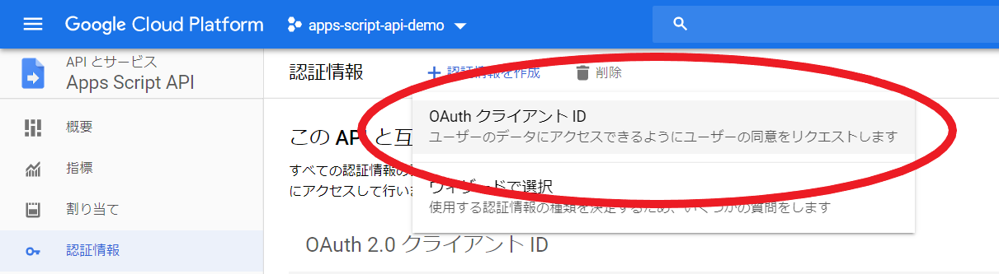
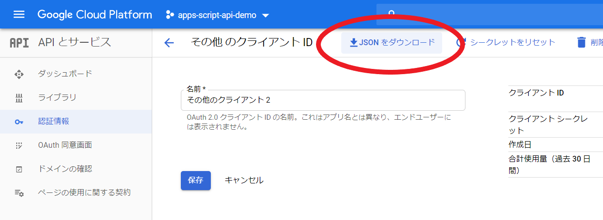

# Google Apps Script API demo

## 手順

```bash
$ git clone git@github.com:nokazn/apps-script-demo-node
$ npm i
$ npm run build
```

実行したい Google Apps Script プロジェクトを作成する。

```js
/**
 * @param {number} id
 * @param {string} name
 */
function test (id, name) {
  var sheet = SpreadsheetApp.openById('xxxxxxxxxxxxxxxxx').getSheetByName('シート1');
  sheet.appendRow([id, name, new Date()]);
  console.log('success!');
}
```

`リソース` > `Cloud Platform プロジェクト`を選択して GAS プロジェクトを GCP プロジェクトに紐づける。
プロジェクト名、プロジェクトIDを`apps-script-api-demo`とする。

スクリプトを保存した後、`公開` > `実行APIとして導入`を選択して、新規バージョンを作成する。

ここで得られる`API ID`を`.env`に追加する。

```
# API ID を追加
SCRIPT_ID=xxxxxxxxxxxxxxxxxxxxxxxxxxxxxx
```

紐づけた　GCP プロジェクトのコンソールに移動する。

[apps-script-api-demo プロジェクトの API とサービス > 認証情報](https://console.cloud.google.com/apis/api/script.googleapis.com/credentials?project=apps-script-api-demo) のページに行き、`認証情報を作成`から OAuth クライアント ID を作成する。



アプリケーションの種類は「その他」を選択し、任意の名前を入力する。

クライアント ID 作成後、IDの編集画面から JSON ファイルをダウンロードする。



ダウンロードした`credential.json`をプロジェクトルートに配置する。

```bash
# 実行
$ node ./dist/index.js
```

## 参考

[Node.js Quickstart  |  Apps Script API  |  Google Developers](https://developers.google.com/apps-script/api/quickstart/nodejs)
